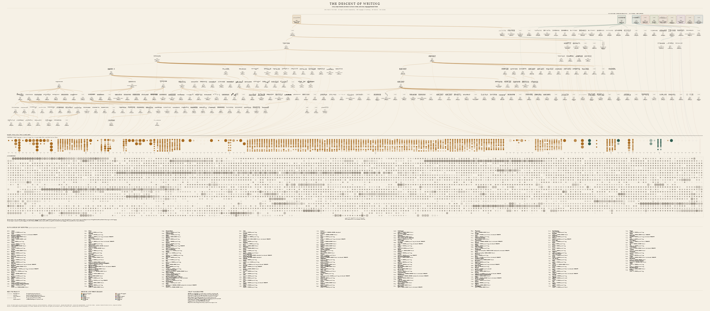
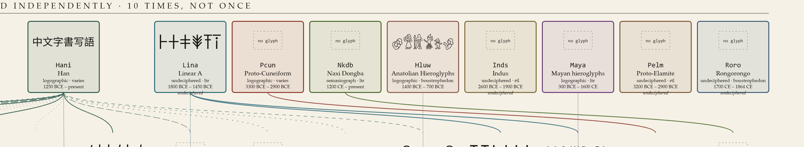
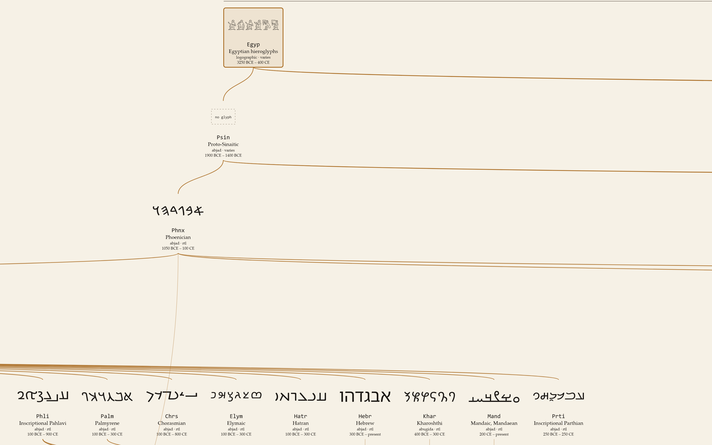
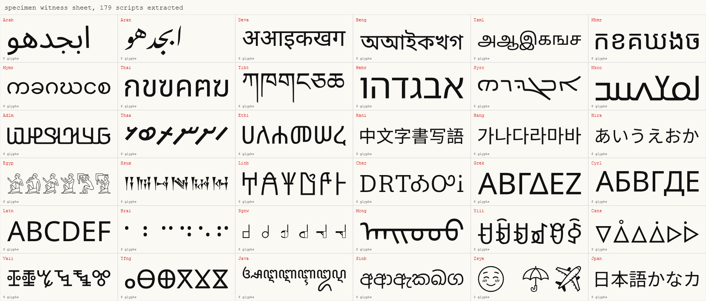
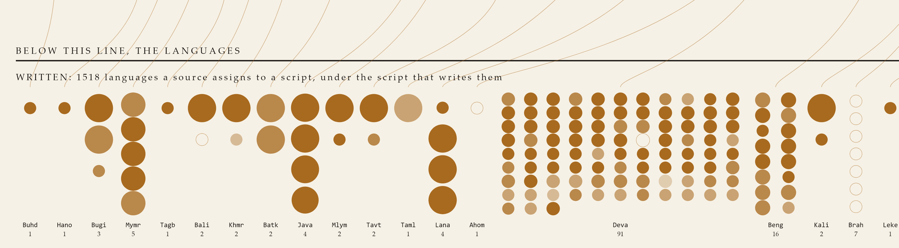
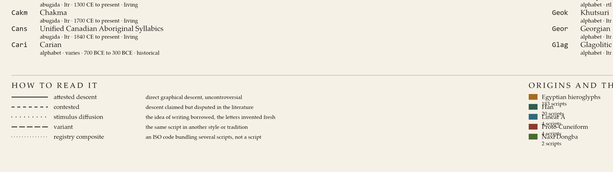

# The Descent of Writing

A single reference plate holding every script in the ISO 15924 registry, arranged by descent from the origins of writing, with every language in Glottolog hung beneath the script that writes it.

218 scripts. 10 independent inventions. 8,587 languages. Nothing sampled, nothing elided.



The deliverable is [`out/descent_of_writing.svg`](out/descent_of_writing.svg), 25,922 x 11,396, where every node carries its ISO 15924 code or Glottocode as an element id. It is built to be zoomed: at full size each script card is legible, and the images below are 1:1 crops of the real file, not redrawn illustrations.

**The brief that produced it is in [PROMPT.md](PROMPT.md)**, written to be handed to any coding agent that can run code and reach the network. It carries the source URLs that actually resolve and a list of the traps that broke the first attempt, so you do not have to rediscover them.

**[CONTINUE.md](CONTINUE.md) says where the soft parts are** and ranks the open work. The short version: 37 of the 56 stimulus edges default to Latin without per-script sourcing, and only 17.7% of languages have a script on record. Both are named there rather than left to be found.

## What it counts

| | |
|---|---|
| ISO 15924 rows loaded | 226 |
| Special and private-use codes removed | 8 (`Zinh` `Zyyy` `Zzzz` `Zmth` `Zsym` `Zxxx`, `Qaaa`..`Qabx`) |
| **Scripts drawn** | **218**, each exactly once |
| With a real glyph specimen | 179 |
| Without | 39, of which 32 are not encoded in Unicode at all |
| Independent origins | 10 |
| Deepest chain of descent | 8 generations |
| **Languages drawn** | **8,587** (8,618 Glottolog languoids at level=language, minus 31 constructed) |
| Families / isolates | 245 / 183 |
| Sign languages | 227 |
| Languages with no script recorded | 7,069 (82.3%) |

Every figure above is recomputed from the source files by [`verify.py`](verify.py) and asserted against the finished SVG.

## Writing was invented more than once

The plate has no single apex. Writing was invented independently at least three times beyond dispute, and the contested cases are drawn as contested rather than resolved.



Scripts that Unicode has never encoded cannot have a font, so they carry a marked gap instead of an invented specimen. Undeciphered scripts say so.

## Descent you can trace

Below the origins, the tree runs to full depth. The Proto-Sinaitic line is the deepest: Egyptian hieroglyphs, Proto-Sinaitic, Phoenician, then Aramaic and Greek, then most of the world.



Edge style carries the strength of the claim: solid for attested graphical descent, dashed for descent disputed in the literature, dotted for stimulus diffusion (the idea of writing borrowed, the letters invented fresh), and separate styles for style variants and for registry codes that bundle several scripts.

## Specimens are shaped, not approximated

Every specimen is a real outline pulled from a Noto face and shaped with HarfBuzz. Shaping is not cosmetic here. Arabic and every Brahmic script build their letterforms through GSUB, and Nastaliq's base glyphs are empty: drawing straight from the cmap gives disconnected stubs or nothing at all.



This sheet is a test, not decoration. It is regenerated by [`specimen_check.py`](specimen_check.py) so a broken extraction shows up as a blank or a tofu box instead of quietly reaching the plate.

## Languages, and the size of what we do not know



Two registers share a width, and their heights are in proportion to how many languages they hold. Mark area is speaker count on a log scale, fading runs from safe through threatened to moribund, and a hollow ring is an extinct language.

The lower register is the honest part. **It is not proof of unwritten languages.** It is the set of languages that Wikidata and CLDR record no script for, and their coverage thins fast outside the major languages. The commonly quoted figure for unwritten languages is around 40%. Open data will not support that number, and it will not support 82% either. What the plate shows is the size of the gap in the record, labelled as exactly that.

## Every script gets a row



All 218 scripts appear again in a catalogue keyed by code, carrying type, direction, span of use, status, and whether a specimen exists. The same rows are in [`out/scripts_catalogue.csv`](out/scripts_catalogue.csv) with 19 columns, so the plate is auditable against its own data.

## Build it

Python 3.10+, roughly 90 MB of downloads, about 15 minutes on a cold start.

```bash
pip install fonttools uharfbuzz brotli
python fetch.py           # ISO 15924, UCD, Glottolog CLDF, CLDR, ISO 639-3
python fetch_wikidata.py  # writing systems, speaker counts, native names
python fonts.py           # ~200 Noto faces, shape and extract outlines
python build_data.py      # join everything into out/dataset.json
python render.py          # draw the plate
python verify.py          # acceptance checks, write the catalogue CSV
```

`fetch_wikidata.py` backs off past the query service's rate limit, which is currently one request per minute, so expect it to sit for a few minutes. Rasterizing uses the Chrome or Edge already installed rather than pulling a renderer:

```bash
python rasterize.py out/descent_of_writing.svg out/descent_of_writing.png 6000 2638
```

## What is asserted, and what is not

**Descent is curated, not scraped.** Wikidata's P144 covers barely half the registry and contradicts itself on the Semitic chain, so the parent of every script is set by hand in [`genealogy.py`](genealogy.py) against standard palaeography (Daniels and Bright, *The World's Writing Systems*; Coulmas, *Blackwell Encyclopedia of Writing Systems*; Unicode script proposals for the recent additions). Each edge is tagged with how strong the claim is. Disagreements belong in issues, and the file is one readable table.

**The origins are a position, not a fact.** Sumerian cuneiform, Chinese oracle bone, and Mesoamerican writing are treated as independent. Egyptian hieroglyphs are marked contested, since stimulus diffusion from Sumer is a live argument. The Indus script is included and marked contested twice over, because whether it encodes language at all is unsettled.

**Emoji is in the registry, so it is on the plate.** `Zsye` is not one of the six special codes the scope removes, so dropping it would have been a silent edit. It is drawn, and typed as a symbol set rather than a writing system.

**The pyramid was traded away.** The sketch this began from was a pyramid. Centring each depth band produced a cleaner silhouette but severed a node's position from its parent's, and the descent lines became long horizontal sweeps nobody could follow. The layout is now a tidy tree. A genealogy you can trace beats a tidier outline.

## Two bugs worth naming

Both would have produced a wrong plate that looked right.

**HarfBuzz cannot open a woff2 blob.** It builds an empty face, every glyph resolves to `.notdef`, and Noto's `.notdef` is a drawn box with real bounds, so it passed the "does this glyph have an outline" check. The CJK specimens were rendering as neat tofu grids. Fixed by decompressing to sfnt before shaping (`TTFont.save()` keeps the woff2 flavor unless you clear it) and by refusing glyph id 0 outright.

**Mark size was relative to each field's own cell.** A script with one language drew fatter dots than a script with ninety-one, inverting the only thing mark size is supposed to say. Fixed with one global cell across both registers.

## Sources

| Source | Used for | Licence |
|---|---|---|
| [ISO 15924 registry](https://www.unicode.org/iso15924/) | the closed list of scripts, the guarantee of completeness | Unicode terms |
| [Unicode Character Database](https://www.unicode.org/Public/UCD/latest/) | encoding status, blocks, general categories | Unicode terms |
| [Glottolog 5 CLDF](https://github.com/glottolog/glottolog-cldf) | languages, families, isolates, endangerment | CC-BY-4.0 |
| [Wikidata](https://query.wikidata.org/) | writing systems (P282), speakers (P1098), native names (P1705) | CC0 |
| [Unicode CLDR](https://github.com/unicode-org/cldr) | a second opinion on language to script | Unicode terms |
| [SIL ISO 639-3 tables](https://iso639-3.sil.org/) | the 639-1 to 639-3 bridge | SIL terms |
| [Noto fonts](https://github.com/notofonts/notofonts.github.io) | glyph specimens | SIL OFL 1.1 |

Sources were retrieved 2026-08-28. The plate prints its own retrieval date.

## Licence

Code is MIT, see [LICENSE](LICENSE). The plate and the catalogue CSV are CC-BY-4.0, since they contain Glottolog data, and the SVG embeds glyph outlines derived from Noto under the SIL Open Font License 1.1. Full terms and the attribution string for reuse are in [NOTICE.md](NOTICE.md).

No source data is redistributed here. The fetch scripts retrieve it at build time, and what is committed under `out/` is the derived result.
